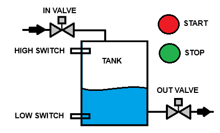
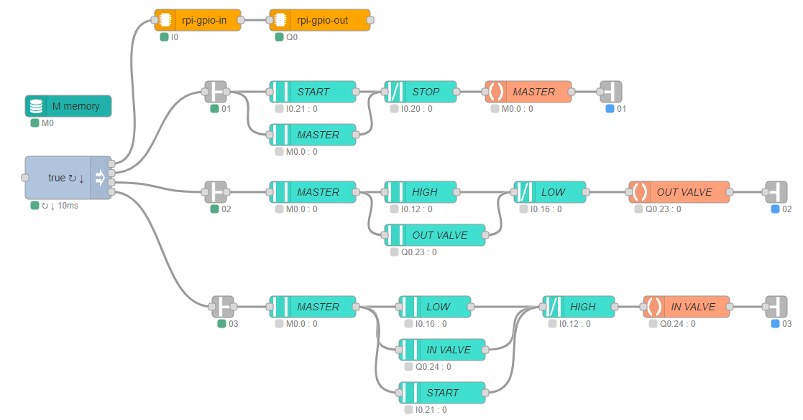
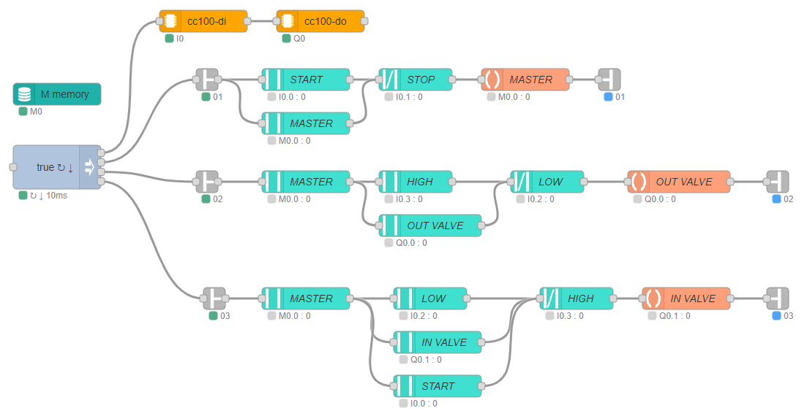

# redPlc Software-PLC

redPlc Node-Red nodes for the realization of Software-PLC with Ladder-Logic according to IEC 61131-3.

 
Thanks for the coffee !! 😁

- Download little tutorial using redPlc:
[automation_using_nodered.pdf](https://github.com/redplc/redplc/raw/main/automation_using_nodered.pdf)

- Install redPlc Nodes: 
[@redplc/node-red-redplc](https://www.npmjs.com/package/@redplc/node-red-redplc/)

- Install Module Nodes. 
Module Nodes exchange data with hardware or communication 
and updates the redPlc variables. 
Module Nodes also creates the I, Q, IA and QA variables. 

### Module Nodes not hardware based 

|Module-Node|Function|
|---|---|
|[@redplc/node-red-time](https://www.npmjs.com/package/@redplc/node-red-time)| Get **System-Time** or **NTP-Time**|

### Module Nodes for Raspberry Pi 

|Module-Node|Function|
|---|---|
|[@redplc/node-red-redplc-gpiox](https://www.npmjs.com/package/@redplc/node-red-redplc-gpiox)|**GPIO** digital input/output using linux V2 character device interface|
|[@redplc/node-red-rpi-ads1115](https://www.npmjs.com/package/@redplc/node-red-rpi-ads1115)|**ads1115** 16bit analog to digital converter|
|[@redplc/node-red-rpi-ds18b20](https://www.npmjs.com/package/@redplc/node-red-rpi-ds18b20) |**ds18b20** temperature sensor|

### Module Nodes for special hardware 
|Module-Node|Function|
|---|---|
|[@redplc/node-red-wago-cc100-io](https://www.npmjs.com/package/@redplc/node-red-wago-cc100-io)|Wago CC100 Controller I/O|

### Example

In this example a tank is being filled or emptied. 
The process is started with the START switch 
and stopped with the STOP switch. 
The filling level of the tank is determined using the LOW SWITCH and HIGH SWITCH. 
When the IN VALVE is activated, the tank is filled. 
When the OUT VALVE is activated, the tank is emptied. 
The control automatically fills and empties the tank. 

This is the original Ladder Logic:

https://www.sanfoundry.com/plc-program-control-level-single-tank/

### Ladder Logic with Raspberry Pi
Node-Red flow file is in examples folder: **Tank_Control_RaspberryPi.json** 

This is the pin assignment for Raspberry Pi: 
|GPIO Pin|Set|Variable|Function|
|:--|:--|:--|:--|
|GPIO21|Input/Pullup|I0.21|START|
|GPIO20|Input/Pullup|I0.20|STOP|
|GPIO16|Input/Pullup|I0.16|LOW SWITCH|
|GPIO12|Input/Pullup|I0.12|HIGH SWITCH|
|GPIO23|Output|Q0.23|OUT VALVE|
|GPIO24|Output|Q0.24|IN VALVE|
|||M0.0|MASTER|

Note: All Raspberry Pi inputs are set to Pullup. 
That's why the switches have to switch to ground. 

### Ladder Logic with Wago Controller CC100
Node-Red flow file is in examples folder: **Tank_Control_cc100.json**

This is the pin assignment for Wago Controller CC100: 
|Pin|Set|Variable|Function|
|:--|:--|:--|:--|
|DI1|Input|I0.0|START|
|DI2|Input|I0.1|STOP|
|DI3|Input|I0.2|LOW SWITCH|
|DI4|Input|I0.3|HIGH SWITCH|
|DO1|Output|Q0.0|OUT VALVE|
|DO2|Output|Q0.1|IN VALVE|
|||M0.0|MASTER|

